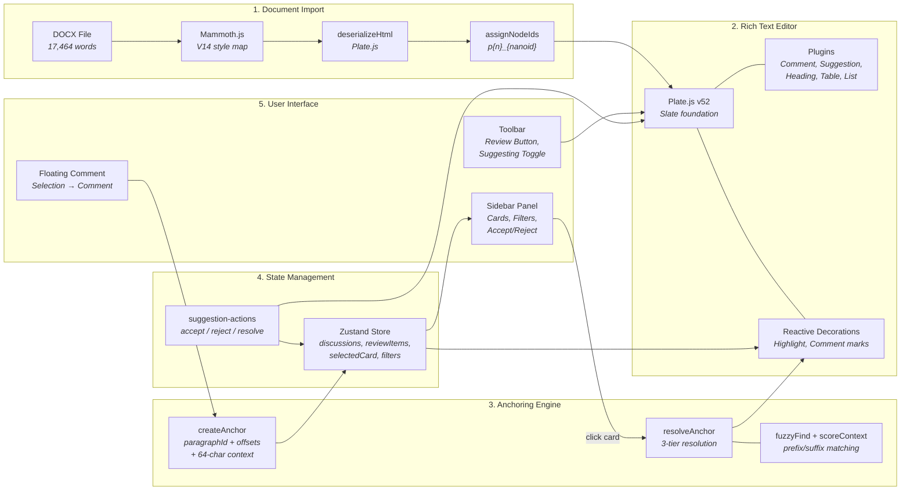
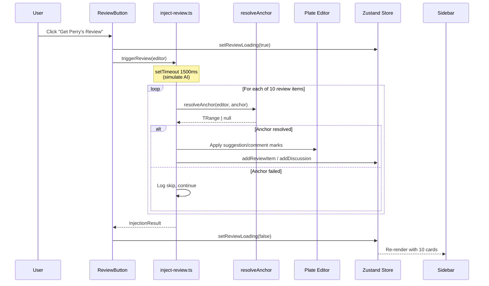
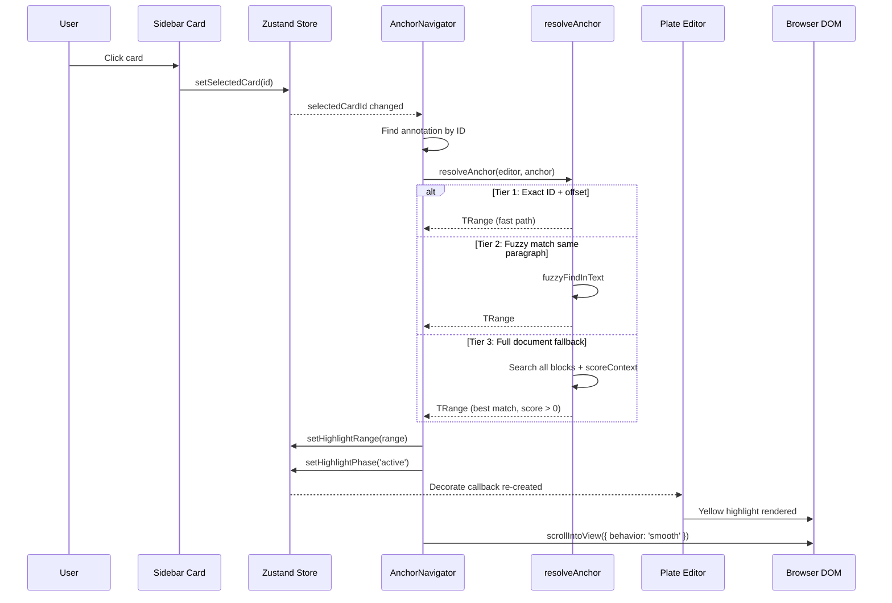
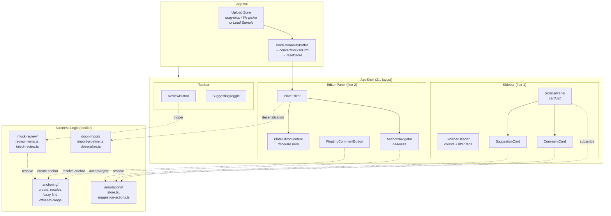
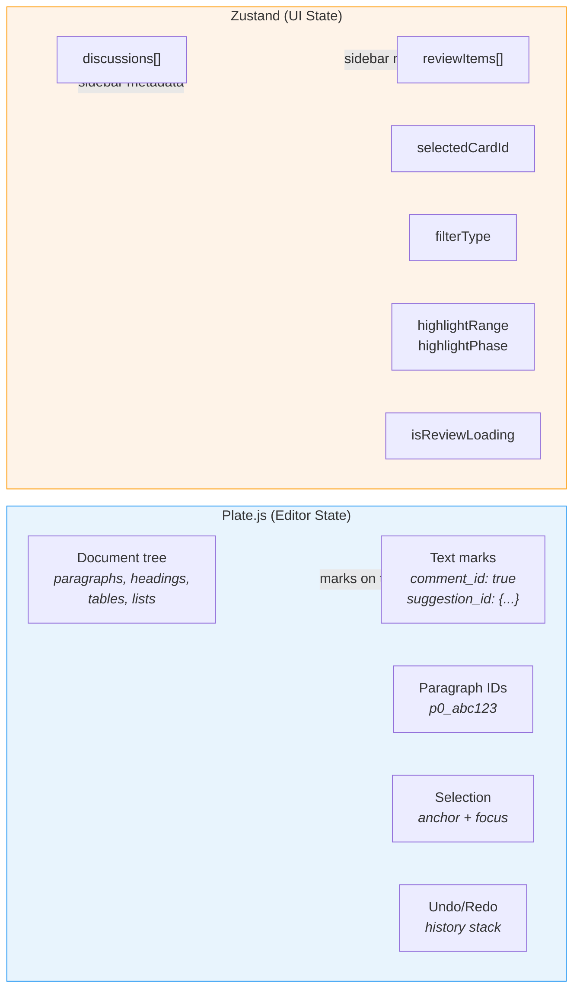
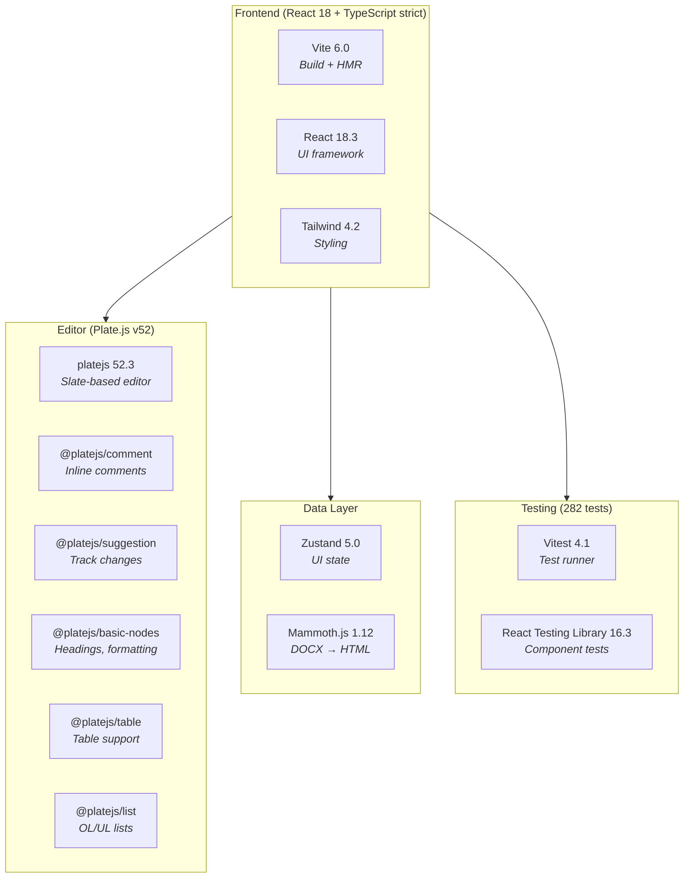
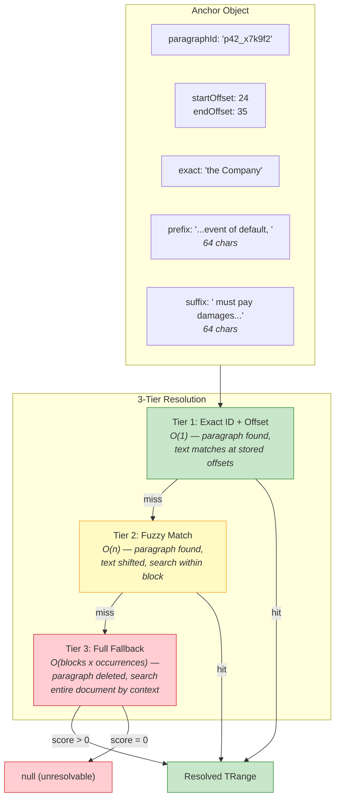

# Architecture Overview

> 15-second glance: how the system works, end to end.

## System Flow



## Data Flow: "Get Perry's Review"



## Data Flow: Card Click → Scroll + Highlight



## Component Architecture



## State Ownership



> **Why the split?** Plate owns data that participates in undo/redo and lives on text nodes. Zustand owns UI metadata (sidebar cards, filters, navigation state). Neither re-renders the other's domain.

## Tech Stack at a Glance



## Anchoring: The Differentiator



## File Map (key files only)

```
src/
├── App.tsx                              # Entry: upload UI → load DOCX → render
├── editor/
│   ├── plate-editor.tsx                 # Editor setup + reactive decorations
│   ├── editor-kit.ts                    # Plugin assembly (10 plugins)
│   ├── anchor-navigator.tsx             # Card click → resolve → scroll
│   └── plugins/                         # Custom leaf renderers
├── components/
│   ├── layout/app-shell.tsx             # 2:1 grid layout
│   ├── sidebar/sidebar-panel.tsx        # Card list + filters
│   ├── sidebar/suggestion-card.tsx      # Suggestion card UI
│   ├── sidebar/comment-card.tsx         # Comment card UI
│   ├── toolbar/review-button.tsx        # "Get Perry's Review"
│   ├── toolbar/suggesting-toggle.tsx    # Track changes toggle
│   └── toolbar/floating-comment-button  # Selection → comment
├── lib/
│   ├── anchoring/                       # THE HARD PROBLEM
│   │   ├── resolve-anchor.ts            # 3-tier resolution
│   │   ├── create-anchor.ts             # Selection → anchor
│   │   ├── fuzzy-find.ts                # Context scoring
│   │   └── offset-to-range.ts           # Offset ↔ Slate range
│   ├── annotations/
│   │   ├── store.ts                     # Zustand store
│   │   └── suggestion-actions.ts        # Accept/reject/resolve
│   ├── mock-review/
│   │   ├── review-items.ts              # 10 verified mock items
│   │   └── inject-review.ts             # Injection pipeline
│   └── docx-import/
│       ├── import-pipeline.ts           # Mammoth.js conversion
│       └── deserialize.ts               # ID assignment
└── types/annotations.ts                 # Anchor, Discussion, ReviewItem
```
