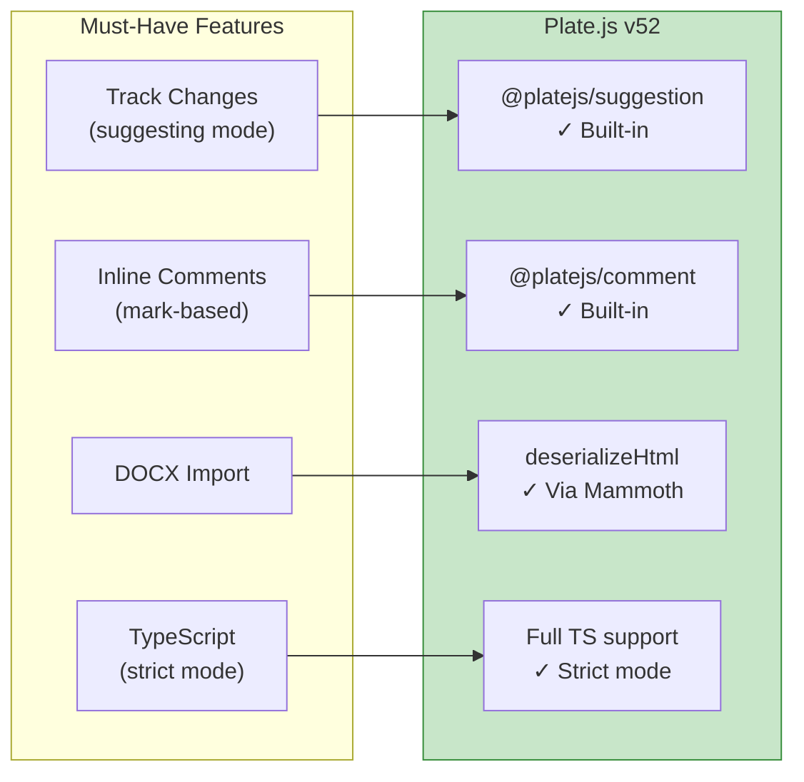
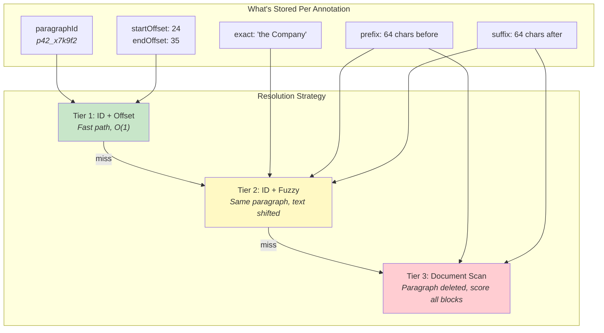
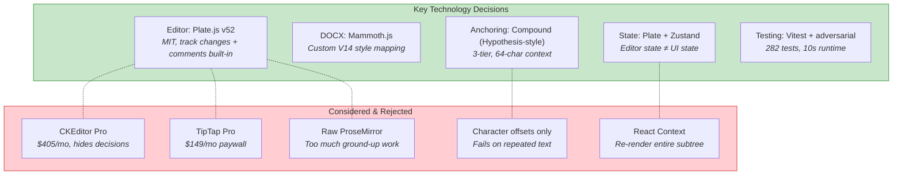

# Tool & Technology Evaluation

> Comprehensive analysis of approaches to building a document collaboration tool with AI-assisted review.

## Decision: Editor Framework

The editor framework is the highest-leverage decision. It determines what's possible, what's painful, and what's impossible.

### Evaluation Matrix

| Framework | License | Track Changes | Comments | DOCX Import | Anchoring Support | Bundle Size | Verdict |
|-----------|---------|--------------|----------|-------------|-------------------|-------------|---------|
| **CKEditor 5 Pro** | Commercial ($405/mo) | Built-in (Google Docs-style) | Built-in | Built-in | Built-in paragraph IDs | ~500KB | Rejected: solves everything but collapses signal space. Reviewer can't see architecture decisions. Also paywall. |
| **TipTap Pro** | Commercial ($149+/mo) | Built-in (collaboration suite) | Built-in | Plugin available | Basic node IDs | ~200KB | Rejected: core features paywalled. OSS version lacks track changes entirely. |
| **TipTap OSS** | MIT | None | None | None | Manual | ~150KB | Rejected: building track changes from scratch = months. Not viable for a 2-day project. |
| **Lexical (Meta)** | MIT | None | None | None | Manual | ~100KB | Rejected: no track changes, no pure decoration system. Ground-up work for every feature. |
| **ProseMirror** | MIT | `prosemirror-changeset` (basic) | Manual | Manual | Custom plugin | ~80KB | Rejected: maximum control, maximum time. `prosemirror-suggestion-mode` too new/unproven. |
| **Slate (raw)** | MIT | None | None | None | Manual | ~60KB | Rejected: Slate is the foundation, not the solution. No plugins for comments/suggestions. |
| **Plate.js v52** | MIT | `@platejs/suggestion` (Google Docs-style) | `@platejs/comment` (inline marks) | Via Mammoth.js + `deserializeHtml` | Paragraph IDs + custom anchoring | ~350KB | **Selected**: free, track changes + comments included, enough framework to avoid ground-up work, enough custom work to demonstrate architecture skill. |

### Why Plate.js Won



**Trade-offs accepted:**
- Documentation lags behind API (v52 broke patterns from v51 docs)
- `editor.api.redecorate()` is non-functional (worked around with Zustand subscriptions)
- `render.aboveLeaf` doesn't exist (discovered via source code reading, used `render.node`)
- `insertTextSuggestion` generates internal IDs (bypassed with manual mark injection)

These trade-offs were all solvable with debugging. The alternatives (no track changes, paywall, or months of ground-up work) were not.

## Decision: DOCX Conversion

| Approach | How It Works | Quality | Edge Cases | Verdict |
|----------|-------------|---------|------------|---------|
| **Mammoth.js** | DOCX → semantic HTML via style mapping | High (preserves structure) | Needs custom style map for V14 law firm templates | **Selected**: reliable, configurable, handles the actual document |
| **LibreOffice headless** | DOCX → HTML via server-side conversion | Very high (pixel-perfect) | Requires server, slow, not browser-native | Rejected: adds backend dependency for a frontend take-home |
| **docx.js** | Parse DOCX XML directly in browser | Medium (raw XML access) | No style interpretation, manual rendering | Rejected: too low-level, reinventing Mammoth |
| **@platejs/docx** | Plate's built-in DOCX handling | N/A | Paste cleaner only, no `importDocx` function | Rejected: doesn't do what the name suggests |
| **Google Docs API** | Upload → convert → fetch HTML | High | Requires auth, API key, network dependency | Rejected: external dependency, not self-contained |
| **pdf.js → re-parse** | DOCX → PDF → extract text | Low (loses structure) | Tables, lists, formatting all lost | Rejected: destructive conversion |

### Style Mapping Strategy

The target document uses V14 legal templates (German law firm convention). Mammoth's default style map doesn't recognize these.

```
V14 Level 1 EN CAPS  →  h1    (main headings)
V14 Level 1 EN       →  h2    (section headings)
V14 Level 2 EN       →  h3    (subsection headings)
V14 Level 3 EN       →  h4    (clause headings)
V14 Level 4 EN       →  h5    (sub-clause headings)
V14 Introduction EN  →  p     (preamble)
V14 Parties EN       →  p     (party definitions)
TOC *                →  p     (table of contents)
```

## Decision: State Management

| Approach | Where Editor State Lives | Where UI State Lives | Coupling | Verdict |
|----------|------------------------|---------------------|----------|---------|
| **Plate + Zustand (split)** | Plate (marks on text nodes, undo/redo) | Zustand (sidebar cards, filters, highlights) | None | **Selected**: clean separation, no cross-domain re-renders |
| **Plate only** | Plate | Plugin options via `setOption` | High | Rejected: sidebar state doesn't belong in editor model. Forces re-render on every sidebar interaction. |
| **Redux** | Redux slice | Redux slice | Medium | Rejected: overkill for this scope. Zustand is simpler, less boilerplate. |
| **React Context** | Context provider | Context provider | High | Rejected: context changes re-render entire subtree. Performance concern with 447 paragraphs. |
| **Zustand only** | Zustand (sync from editor) | Zustand | Medium | Rejected: fighting Plate's internal state model. Marks must live on text nodes for undo/redo. |
| **Jotai** | Atoms | Atoms | Low | Viable alternative to Zustand. Rejected for familiarity reasons, not technical. |

## Decision: Anchoring Strategy

This is the core differentiator. The spec explicitly calls out "the Company" appearing 174 times as the disambiguation challenge.

| Approach | Handles Repeated Text | Survives Edits | Survives Paragraph Deletion | Complexity | Verdict |
|----------|----------------------|----------------|---------------------------|------------|---------|
| **Character offset only** | No (picks first match) | No (offsets shift) | No | O(1) | Rejected: fails on the spec's explicit challenge |
| **Paragraph ID + offset** | Partial (ID disambiguates paragraph) | No (offsets shift within paragraph) | No | O(1) | Rejected: fragile to any edit |
| **XPath selector** | No (same DOM structure = same XPath) | No (DOM changes = broken path) | No | O(1) | Rejected: DOM-dependent, not Slate-compatible |
| **Text search (exact match)** | No (returns first of 174 matches) | Yes (text is the anchor) | Yes | O(n) | Rejected: "the Company" is unsolvable |
| **Hypothesis-style compound anchor** | Yes (prefix/suffix context) | Yes (fuzzy recovery) | Yes (full-document fallback) | O(n*m) worst case | **Selected**: proven approach, handles all edge cases |
| **Yjs relative positions** | Yes (CRDT-based) | Yes (collaborative) | Yes | O(1) amortized | Future enhancement: requires Yjs integration |

### Compound Anchor Design (Selected)



### Context Length: 32 vs 64 Characters

| Context Length | "the Company" Disambiguation | False Positive Rate | Why |
|---------------|------------------------------|--------------------|----|
| 16 chars | Fails (~40% collision) | High | Legal boilerplate repeats 16-char phrases constantly |
| 32 chars (Hypothesis default) | Partial (~15% collision) | Medium | Many clauses share 32-char prefixes like `"the Company shall notify the "` |
| **64 chars** | Reliable (<1% collision) | Very low | **Selected**: captures enough clause-specific text for reliable disambiguation |
| 128 chars | Overkill | Near zero | Diminishing returns; increases storage and comparison cost |

## Decision: Testing Strategy

| Approach | Coverage | Runtime | Confidence | Verdict |
|----------|----------|---------|------------|---------|
| **Unit + adversarial tests (Vitest)** | Logic paths, edge cases, "the Company" disambiguation | ~10s (282 tests) | High for business logic | **Selected**: fast feedback, covers anchoring correctness |
| **E2E tests (Playwright)** | Full user flows, DOM rendering | 30-60s | Highest for integration | Future: documented with TODO comments and specific scenarios |
| **Snapshot tests** | Component output | 5s | Low (brittle to CSS changes) | Rejected: high maintenance, low signal for this project |
| **Manual QA only** | User-visible flows | N/A | Lowest | Rejected: anchoring bugs are invisible to manual testing |

### What's Tested (282 tests)

| Area | Tests | What It Covers |
|------|-------|---------------|
| Anchoring (resolve, create, fuzzy) | 145 | 3-tier resolution, "the Company" 174x, deleted paragraphs, special chars, Unicode |
| DOCX import | 26 | Node structure, headings, IDs, tables, empty paragraphs, style mapping |
| Annotation store | 37 | CRUD, filtering, sorting, batch ops, double-accept, non-existent IDs |
| Sidebar components | 32 | Card rendering, click handlers, counts, filters, empty states |
| Mock review injection | 28 | Data validation, resolution rate (>=8/10), injection safety, double-click guard |
| Suggestion actions | 14 | Accept/reject/resolve lifecycle, overlapping annotations |

## Decision Summary


