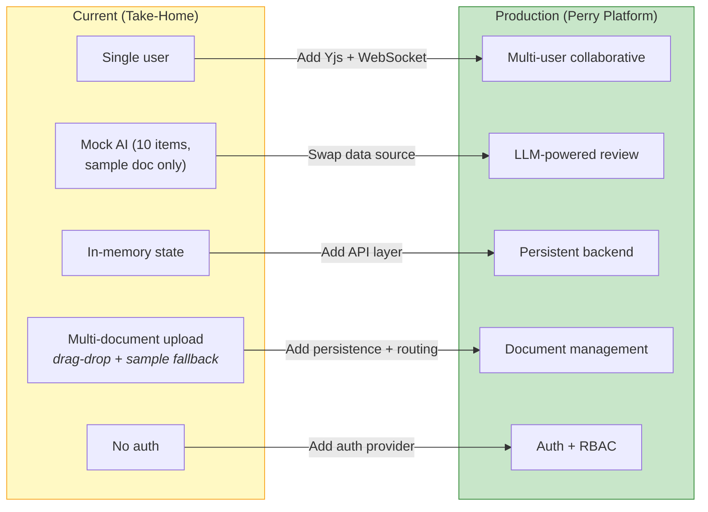
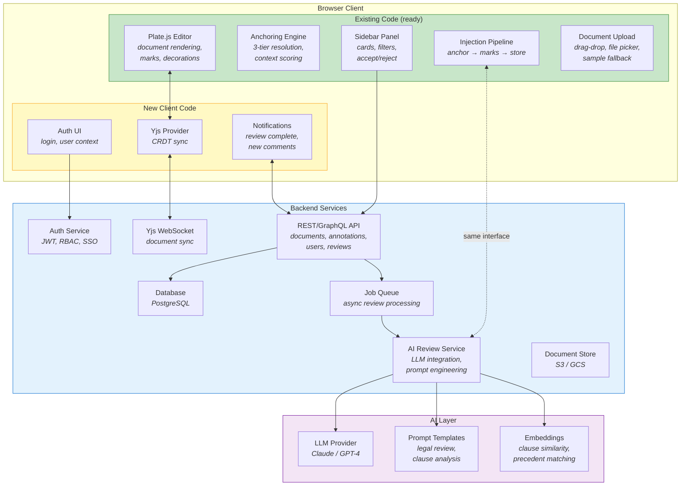
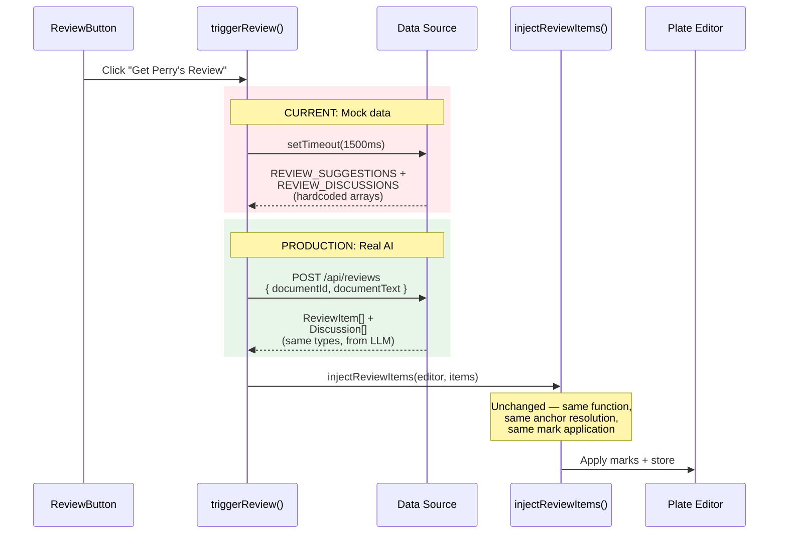
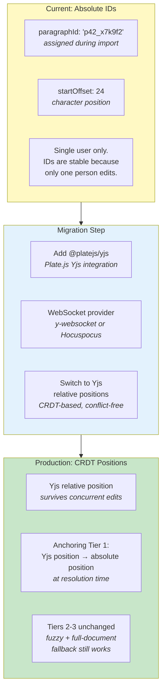
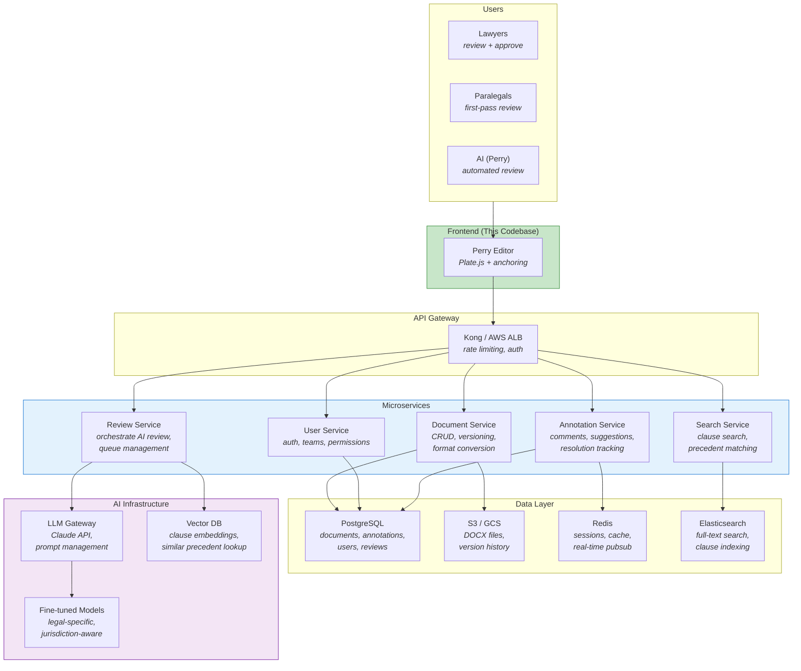
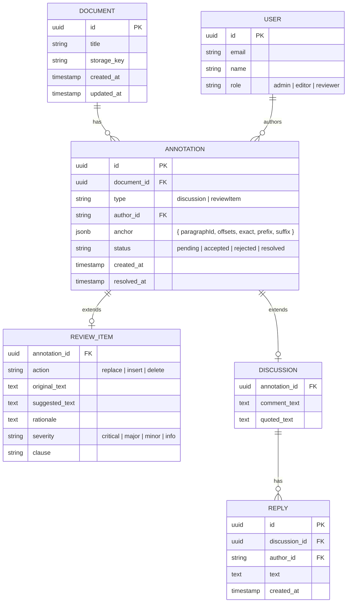
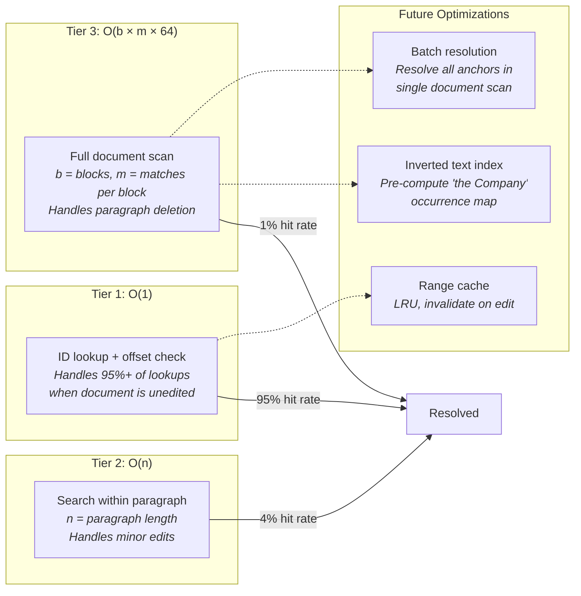
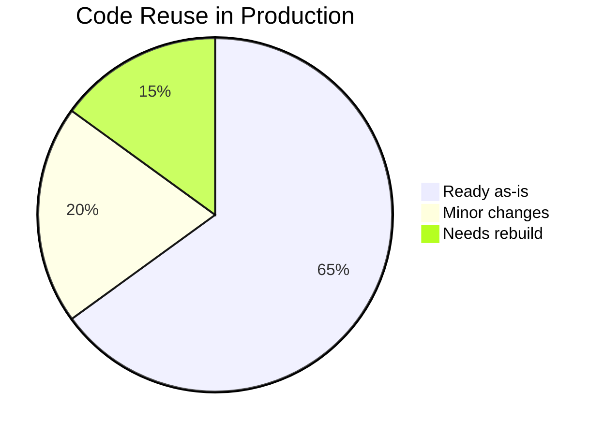

# Extensibility Roadmap

> How this plugs into a typical legaltech platform. What's ready, what needs to change, and how it scales.

## Current State vs Production Target



## Production Architecture



## Integration Readiness Assessment

### Already Production-Ready

| Component | Why It's Ready | Integration Point |
|-----------|---------------|-------------------|
| **Anchoring Engine** | 3-tier resolution handles repeated text, deleted paragraphs, edited text. 282 adversarial tests. | Anchors are serializable JSON — store in any database. `resolveAnchor()` takes an editor instance and returns a range. |
| **Injection Pipeline** | `injectReviewItems()` accepts any array of `ReviewItem` / `Discussion` objects. Per-item error handling. | Replace mock `setTimeout` with `fetch('/api/review')`. The injection function doesn't care where data comes from. |
| **Suggestion Actions** | `applySuggestionAccept/Reject/Resolve` are pure functions that take editor + ID. | Add API call after local state update: `await api.updateAnnotation(id, status)`. |
| **DOCX Import** | Mammoth.js style map handles V14 legal templates + standard Word headings. Drag-drop upload already implemented. `assignNodeIds` produces stable, sortable IDs. | Upload UI is ready. For production: add server-side storage after upload. Same pipeline. |
| **Sidebar Components** | Cards, filters, counts are data-driven. Subscribe to Zustand. | Zustand store can hydrate from API response. Components don't know or care about data source. |
| **Type System** | `Anchor`, `Discussion`, `ReviewItem` types are well-defined. Discriminated unions. | Types become your API contract. Generate OpenAPI schema from TypeScript types. |

### Needs Modification

| Component | What Changes | Effort | How |
|-----------|-------------|--------|-----|
| **State persistence** | Zustand is in-memory → need API sync | Medium | Add middleware: `zustand/middleware` with `persist` for optimistic local cache + API sync on mutation |
| **User identity** | Hardcoded `'user-1'` → real auth | Low | Replace `currentUserId: 'user-1'` in `editor-kit.ts` with user from auth context. ~5 lines. |
| **Document routing** | Upload UI exists → add persistence + document list | Low-Medium | Upload + drag-drop is implemented. Add React Router for document list page, backend storage for persistence across sessions. |
| **Review trigger** | Mock `setTimeout` → real API call | Low | Replace `triggerReview()` body with `const items = await api.requestReview(documentId)`. Injection pipeline is unchanged. |
| **Collaborative editing** | Single-user → multi-user real-time | High | Add `@platejs/yjs` plugin + WebSocket provider. Anchoring switches from absolute paragraph IDs to Yjs relative positions. |

### Needs to Be Built

| Component | Why It's New | Effort | Architecture Notes |
|-----------|-------------|--------|--------------------|
| **Auth + RBAC** | No auth in take-home | Medium | Standard JWT + role-based access. Roles: reviewer, editor, admin. Plate's `currentUserId` already supports per-user attribution. |
| **Backend API** | No backend in take-home | Medium | REST or GraphQL. Core entities: Document, Annotation (polymorphic: Discussion \| ReviewItem), User, Review (job). |
| **AI Review Service** | Mock data → LLM integration | High | Prompt engineering for legal review. Need: clause extraction, risk assessment, suggestion generation. Output format already defined by `ReviewItem` type. |
| **Document management** | Upload exists → add library + persistence | Low-Medium | Upload/drag-drop UI is built. Remaining: document list, search, version history. S3 for storage, PostgreSQL for metadata. |
| **Notification system** | None | Low | WebSocket or SSE for real-time updates. "Review complete", "New comment on your suggestion". |

## AI Integration: Swap Path

The injection pipeline is designed for this exact swap. Here's the interface boundary:



**What the AI service returns** (same shape as mock data):

```typescript
// The AI service must return this exact shape.
// The frontend injection pipeline handles everything else.
interface AIReviewResponse {
  suggestions: ReviewItem[];   // { anchor, originalText, suggestedText, rationale, severity, ... }
  discussions: Discussion[];   // { anchor, text, quotedText, ... }
}

// Each anchor must include:
interface Anchor {
  paragraphId: string;     // Can be '__unresolved__' — Tier 3 handles it
  startOffset: number;
  endOffset: number;
  exact: string;           // The exact text being commented on
  prefix: string;          // 64 chars before (for disambiguation)
  suffix: string;          // 64 chars after
}
```

The AI service doesn't need to know paragraph IDs. It can return `__unresolved__` for all of them — the 3-tier anchoring system resolves everything using `exact` + `prefix` + `suffix` context. This is by design.

## Collaborative Editing: Migration Path



**Key insight:** Tiers 2 and 3 of the anchoring system (fuzzy match + full document fallback) work regardless of how paragraph IDs are generated. The 64-char prefix/suffix context is the real anchor — IDs are just a fast-path optimization. This means:

1. **Tier 1** needs to change (absolute IDs → Yjs relative positions)
2. **Tiers 2-3** work as-is (context scoring is ID-independent)
3. **The migration is incremental**, not a rewrite

## Scaling: Typical Legaltech Stack



## Database Schema (Annotations)

The Zustand store maps directly to a relational schema:



**The `anchor` column is JSONB** — the same `Anchor` type from the frontend is stored directly. No transformation needed. `resolveAnchor()` works the same whether the anchor comes from Zustand or PostgreSQL.

## Performance Scaling

| Scale | Documents | Annotations/Doc | Concurrent Users | Bottleneck | Mitigation |
|-------|-----------|----------------|-----------------|------------|------------|
| **Current** | 1 | 10-50 | 1 | None | N/A |
| **Small firm** | 100 | 50-200 | 5-10 | Sidebar rendering | Virtualize card list (react-window) |
| **Mid-market** | 1,000 | 200-500 | 20-50 | Anchor resolution at scale | Cache resolved ranges; invalidate on edit |
| **Enterprise** | 10,000+ | 500-1,000 | 100+ | Real-time sync, AI throughput | Yjs CRDT, job queue for AI reviews, CDN for DOCX files |

### Anchoring Performance at Scale



For the current document (447 paragraphs, 10 annotations), Tier 3 completes in <10ms. For a 10,000-paragraph document with 500 annotations, the optimization column becomes relevant — but the architecture supports all three optimizations without structural changes.

## Summary: What's Portable



| Category | Components | % of Codebase |
|----------|-----------|---------------|
| **Ready as-is** | Anchoring engine, injection pipeline, sidebar components, DOCX import, type system, suggestion actions | ~65% |
| **Minor changes** | State persistence (add API sync), user identity (swap hardcoded ID), review trigger (swap mock → API), document routing (add router) | ~20% |
| **Needs rebuild** | Auth system, backend API, AI review service, collaborative editing (Yjs), document management | ~15% (new code, not replacement) |

The anchoring engine — the project's differentiating feature — is 100% production-portable. It doesn't depend on mock data, specific document content, or single-user assumptions. Pass it an editor and an anchor, get back a range. That contract holds from prototype to production.
